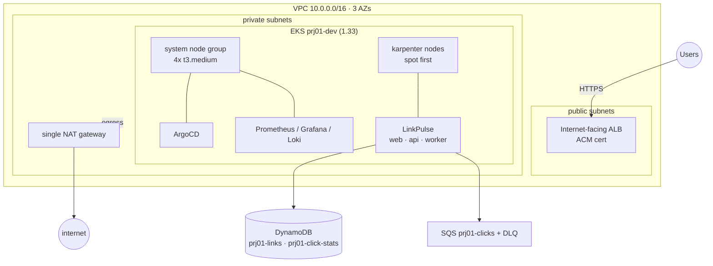
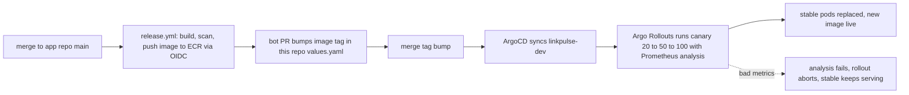

# prj01-eks-gitops-platform

[](https://github.com/maorbrantz/prj01-eks-gitops-platform/actions/workflows/ci.yml)
[](https://github.com/maorbrantz/prj01-eks-gitops-platform/actions/workflows/apply.yml)

A production-shaped Kubernetes platform on AWS, driven end to end by GitOps. Terraform provisions the VPC, the EKS cluster, and the AWS data resources; ArgoCD then runs everything inside the cluster from this repo: the platform addons, the autoscaler config, the policies, and the LinkPulse application itself. Nobody runs `kubectl apply` to change the running system, and there are no static AWS credentials anywhere in it. Application versions ship as a canary that Argo Rollouts advances only when Prometheus says the new pods are healthy, and rolls back automatically when they are not. The whole platform comes up in minutes, serves real traffic over HTTPS, and tears down again with one command.

Live at **https://linkpulse.prj1.maorbrantz.com**. Application code lives in [prj01-linkpulse-app](https://github.com/maorbrantz/prj01-linkpulse-app).


## Architecture

The cluster is `prj01-dev`, EKS 1.33, in `il-central-1`. It runs in a dedicated VPC across three availability zones with nodes in the private subnets. A small managed node group carries the system workloads (ArgoCD, the controllers, Prometheus); application pods land on nodes that Karpenter provisions on demand, spot when it can get it. Users reach the app through an internet-facing ALB with an ACM certificate.


The [draw.io source](docs/diagrams/prj01-architecture.drawio) is in the repo and the PNG has the diagram XML embedded, so both open in draw.io for editing. [docs/diagrams/prj01-architecture.md](docs/diagrams/prj01-architecture.md) walks the request and delivery flows. The same system as a mermaid sketch:



ArgoCD watches this repo as an app-of-apps and reconciles 17 Applications to Synced and Healthy. `docs/architecture.md` covers the network, the GitOps model, the security model, and the autoscaling story in full.

## Highlights

- Zero `kubectl apply` to the running system. A merge is the only way in, and drift is reverted on the next reconcile.
- Zero static AWS credentials anywhere. CI authenticates through GitHub OIDC; every pod that touches AWS uses EKS Pod Identity.
- Automatic canary rollback, proven. A release with an injected 500-error rate failed its Prometheus analysis and Argo Rollouts rolled it back with no human action, while stable pods served every request. See `docs/proof/canary-auto-rollback.txt`.
- Spot-first autoscaling, proven. Under a k6 load test the HPA scaled the api and Karpenter provisioned a spot node, then consolidated it away when load dropped. See `docs/proof/karpenter-scale-out.txt`.
- Policy enforcement, proven. Kyverno blocks `:latest` images, privileged and root containers, and workloads missing resource requests and limits.
- Everything is code, including the dashboards. Grafana boards ship as ConfigMaps in git next to the manifests they visualize.
- Self-managed ArgoCD. After a one-time bootstrap, ArgoCD reconciles its own chart from this repo like any other addon.
- Ephemeral by design. `make up` to `make down` in one session; the steady-state cost when nobody is working is close to zero.

## Platform components

Every component below is an ArgoCD Application under `gitops/platform/`, reconciled from this repo.

| Tool | Role | Where |
|---|---|---|
| Terraform | VPC, EKS, data resources, IAM, CI identity | `terraform/` |
| ArgoCD | GitOps engine, app-of-apps, self-managed | `gitops/platform/argocd`, `gitops/bootstrap` |
| Argo Rollouts | Canary delivery with Prometheus analysis gates | `gitops/platform/argo-rollouts` |
| Karpenter | Node autoscaling, spot-first with on-demand fallback | `gitops/platform/karpenter`, `.../karpenter-nodepools` |
| AWS Load Balancer Controller | Native ALB ingress | `gitops/platform/aws-load-balancer-controller` |
| ExternalDNS | Route53 records for the app and tooling hostnames | `gitops/platform/external-dns` |
| cert-manager | TLS certificates in the hosted zone | `gitops/platform/cert-manager` |
| External Secrets | Secrets pulled from AWS Secrets Manager, none in git | `gitops/platform/external-secrets` |
| Kyverno | Four enforce policies on the app namespaces | `gitops/platform/kyverno`, `.../kyverno-policies` |
| kube-prometheus-stack | Metrics, Grafana, Alertmanager, alert rules | `gitops/platform/kube-prometheus-stack`, `.../monitors` |
| Loki + promtail | Log aggregation, queryable in Grafana | `gitops/platform/loki` |
| Grafana dashboards | Golden signals and platform overview, as code | `gitops/platform/grafana-dashboards` |
| metrics-server | Resource metrics for the HPA | `gitops/platform/metrics-server` |
| LinkPulse | The application, deployed via a multi-source app | `gitops/platform/linkpulse`, `gitops/apps/dev/linkpulse` |

## How a change ships

A code merge in the app repo reaches new pods serving traffic with no one touching the cluster. `docs/gitops-flow.md` walks it step by step, with the real workflow and pull request names.



The api runs as an Argo Rollout with a replica-ratio canary: 20 percent, analysis, 50 percent, analysis, then full. Between the weight steps the rollout queries Prometheus for the canary's success rate (target at or above 99 percent) and p95 latency (under 500ms), measured on the canary pods only, and advances only if both pass. Bad metrics abort the rollout back to stable.

## Proof it works

A canary mid-flight, captured in ArgoCD while a ui change shipped through the pipeline: the new ReplicaSet next to stable, an AnalysisRun querying Prometheus, and the sync annotated with the deploy PR merge.


Each transcript in `docs/proof/` is a captured run from a real `make up` session. [docs/proof/README.md](docs/proof/README.md) indexes them and holds the full screenshot set (the analysis verdict, the golden signals dashboard riding a load test, the app live).

| Artifact | What it proves |
|---|---|
| [rollout-canary-steps.txt](docs/proof/rollout-canary-steps.txt) | A tag bump drives a canary 20 to 50 to 100 with stable never scaled to zero |
| [canary-analysis-pass.txt](docs/proof/canary-analysis-pass.txt) | Prometheus analysis passes a healthy release and the rollout completes on its own |
| [canary-auto-rollback.txt](docs/proof/canary-auto-rollback.txt) | A bad release fails its analysis and Argo Rollouts rolls it back while stable serves clean |
| [karpenter-scale-out.txt](docs/proof/karpenter-scale-out.txt) | HPA plus Karpenter scale out on a spot node under load and consolidate back down |
| [grafana-dashboards.txt](docs/proof/grafana-dashboards.txt) | Dashboards, datasources, and Loki log streams populated with live data |

The GitOps deploy loop, self-heal, and Kyverno blocking are visible in the pull request history: [#4](https://github.com/maorbrantz/prj01-eks-gitops-platform/pull/4) and [#15](https://github.com/maorbrantz/prj01-eks-gitops-platform/pull/15) stand up ArgoCD and the app via GitOps, [#22](https://github.com/maorbrantz/prj01-eks-gitops-platform/pull/22) adds rollouts and the Karpenter NodePool, [#26](https://github.com/maorbrantz/prj01-eks-gitops-platform/pull/26) adds the observability stack, and [#32](https://github.com/maorbrantz/prj01-eks-gitops-platform/pull/32) plus [#33](https://github.com/maorbrantz/prj01-eks-gitops-platform/pull/33) inject and then revert the canary failure that drives the auto-rollback demo.

## Quickstart

Everything assumes the `prj01` AWS profile and `il-central-1`. The full operating guide is in `docs/runbook.md`.

```
make bootstrap     # fmt, init, validate, plan the state backend + OIDC + CI roles
make plan          # review the dev env plan first
make up FORCE=1    # terraform apply: VPC, EKS, data, IAM (FORCE=1 is deliberate)
make argocd        # install ArgoCD and hand control to git
# ... work or demo ...
make down FORCE=1  # terraform destroy of the dev env
```

`make bootstrap` and `make up` refuse to touch AWS without an explicit step, so an apply is never accidental. One thing is a manual prerequisite and stays that way on purpose: the public hosted zone `prj1.maorbrantz.com` was created once by hand and delegated from GoDaddy with NS records. Terraform references it with a data source and never creates or destroys it, because recreating the zone would change its NS set and break the delegation.

After `make argocd`, watch the tree converge with `kubectl -n argocd get applications.argoproj.io -o wide`. When every Application reads Synced and Healthy the app is serving at https://linkpulse.prj1.maorbrantz.com.

## Design decisions

The ADRs in `docs/adr/` are short and each records one choice.

- [001 Bootstrap local state](docs/adr/001-bootstrap-local-state.md): the bootstrap stack keeps local state, because it is the thing that creates the remote backend everything else uses.
- [002 Single NAT gateway](docs/adr/002-single-nat-gateway.md): one NAT for all three AZs in dev to save cost, accepting the single point of failure; per-AZ NAT is the production answer.
- [003 EKS and ArgoCD over simpler options](docs/adr/003-eks-and-argocd-over-simpler-options.md): the point is to show a real platform, so managed Kubernetes plus a GitOps engine over a container-runner service.
- [004 Two-repo GitOps split](docs/adr/004-two-repo-gitops-split.md): app code and desired cluster state in separate repos, joined inside ArgoCD as a multi-source app.
- [005 Karpenter spot-first with on-demand fallback](docs/adr/005-karpenter-spot-first-with-on-demand-fallback.md): a wide NodePool that prefers spot and falls back to on-demand rather than stranding pods, capped at 32 vCPU.
- [006 Pod Identity over static credentials](docs/adr/006-pod-identity-over-static-credentials.md): EKS Pod Identity for every AWS-touching pod, over IRSA and over long-lived keys.
- [007 Replica-ratio canary without a mesh](docs/adr/007-replica-ratio-canary-without-mesh.md): express canary weight as a share of pods instead of adding a service mesh or traffic router.

## Cost

The platform runs at roughly $0.40 per hour with a light load, a bit more while a load test has Karpenter nodes up. Left running around the clock the fixed pieces (control plane, system nodes, NAT, ALB) dominate, which is why it is built to be destroyed and rebuilt rather than left up. Rebuilding is `make up FORCE=1` then `make argocd`, and ArgoCD reconciles the whole tree back on its own. What survives a teardown (the state bucket, ECR images, the hosted zone, the OIDC and CI roles) costs almost nothing. Full breakdown in `docs/cost-analysis.md`.

## What I would do next

The honest backlog, roughly in the order I would pick it up:

- Persistent storage for Prometheus and Loki. They currently use `emptyDir` with 24h retention, so a pod restart loses history. The EBS CSI driver and PVCs are the fix.
- KEDA on the worker, scaling on SQS queue depth instead of the current single replica. Queue depth is the honest signal for a consumer.
- A real prod environment: a second cluster driven by ApplicationSets, with prod promotion as a human-approved PR copying the proven tag from dev.
- Renovate to keep chart and provider versions fresh, so the repo stays alive rather than pinned in time.
- A fine-grained PAT for the release bot, scoped to just this repo, replacing the broader token it uses to open the tag-bump PR.
- Larger system instances or prefix delegation on the node group, to raise the pod-per-node ceiling that currently pushes app pods onto Karpenter early.
- Velero for backup and restore, to make the teardown story a restore story too.
