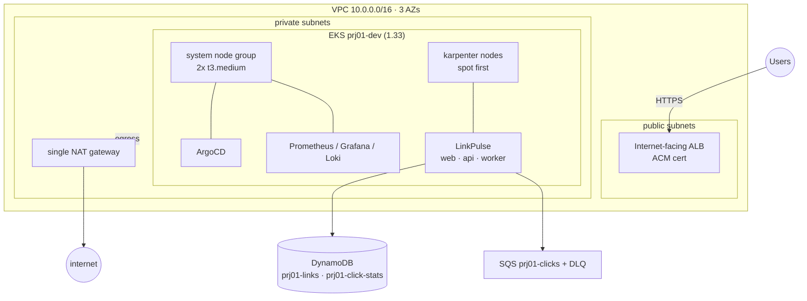
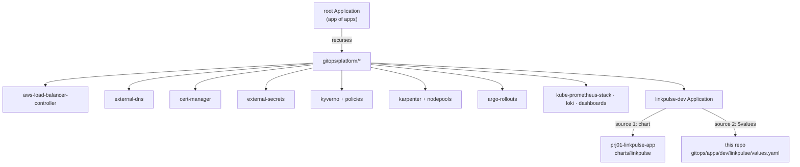
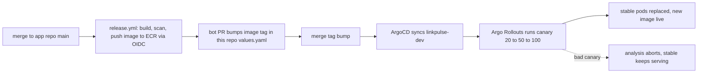

# Architecture

This is a production-shaped Kubernetes platform on AWS. Terraform provisions the
VPC, the EKS cluster, the data resources, and the CI identity. ArgoCD then takes
over and runs everything inside the cluster from git: the platform addons, the
autoscaler config, the policies, and the LinkPulse application itself. Nobody runs
`kubectl apply` to change the running system. A commit is the only way in.

The whole thing is built to come up in minutes, serve real traffic over a real
domain, and be torn down again with one command. It runs in a Ness sandbox account
(`149536464688`) in `il-central-1`, and the cost section covers why the ephemeral
pattern matters here.

## Network and cluster layout

The cluster is `prj01-dev`, EKS 1.33, in a dedicated VPC (`10.0.0.0/16`) spread
across three availability zones. Nodes live in the private subnets. The public
subnets exist only to host the internet-facing ALB. A single NAT gateway carries
outbound traffic for all three AZs, which is a deliberate cost trade documented in
ADR 002 (per-AZ NAT is the production answer, and it triples the NAT bill).

Two kinds of nodes run here. A small managed node group of two `t3.medium`
instances carries the system workloads (ArgoCD, the controllers, Prometheus). The
application workloads land on nodes that Karpenter provisions on demand, spot when
it can get it. The managed group is the stable floor, Karpenter is the elastic
layer on top.

The EKS API endpoint is public and private both. Public access is on so I can
reach the cluster from my workstation without a bastion. Nodes still talk to the
API over the private path. For a real environment I would make the endpoint
private and restrict the public CIDRs, but this is a disposable dev cluster and
the convenience is worth it here.

## GitOps model

ArgoCD is installed once by `scripts/bootstrap-cluster.sh`, then it manages
itself. The bootstrap script helm-installs ArgoCD from a pinned chart and applies
the root Application, and from that point ArgoCD reconciles its own chart from git
like any other addon.

The root is an app-of-apps. It watches `gitops/platform` recursively and picks up
every `application.yaml` and `project.yaml` under it, so adding an addon is just
adding a folder with an Application manifest. The root and the platform addons run
under the `platform` AppProject. The application runs under a separate `apps`
AppProject that can only touch the `linkpulse-dev` namespace, which keeps the app
from ever reaching cluster-scoped resources it has no business touching.

Two repos, on purpose. This repo holds infrastructure and desired cluster state.
The application code and its Helm chart live in `prj01-linkpulse-app`. The split
means the app team ships code without ever editing infra, and infra changes never
force an app rebuild. ADR 004 covers the reasoning.

The LinkPulse Application is a multi-source app, which is where the two repos meet
inside ArgoCD. One source is the Helm chart in the app repo. The other source is
this repo, referenced as `$values`, supplying the environment values file at
`gitops/apps/dev/linkpulse/values.yaml`. That values file is where the image tag
lives, so promotion is a one-line change in this repo and never a change to the
chart.

Sync policy across the tree is automated with prune and self-heal on. A manual
edit to a live object gets reverted on the next reconcile, which is the drift
detection story: git is the source of truth and the cluster is pulled back to it.

## Deployment flow

The full loop from a code merge to new pods serving traffic runs without anyone
touching the cluster. `docs/gitops-flow.md` walks it step by step, but the shape
is this:

The api runs as an Argo Rollout with a replica-ratio canary (20 percent, pause,
50 percent, pause, then full). Progression is currently pause-based, and the
Prometheus-driven analysis that turns a bad canary into an automatic rollback is
landing with the monitoring layer described below. Even now, an aborted rollout
leaves the stable ReplicaSet serving, so a failed rollout never takes the app
down.

## Security model

There are no static AWS credentials anywhere in this system. Two mechanisms carry
that.

CI authenticates to AWS through GitHub OIDC. The bootstrap stack creates the OIDC
provider and three scoped roles. `prj01-ci-plan` is assumable from any ref of this
repo and is read-only plus just enough state access to run `terraform plan`.
`prj01-ci-apply` is restricted by trust policy to the `main` branch only, so a pull
request from a fork or a feature branch can never assume it. `prj01-app-ci` is
scoped to the app repo and can only push to the LinkPulse ECR repos. The apply
role carries AdministratorAccess because the platform provisions VPC, EKS, and IAM
across the account, which is a sandbox choice; production would attach a permission
boundary there instead (ADR 006 and the runbook both flag this).

Pods that touch AWS use EKS Pod Identity, not node roles and not long-lived keys.
Each service account is bound to an IAM role scoped to exactly what that pod needs.
The api role can read and write the two DynamoDB tables and send to the click
queue. The worker role can consume the click queue and write the stats table. The
platform controllers get the same treatment: external-dns can only manage records
in the one hosted zone it owns, external-secrets reads Secrets Manager, and so on.
No application pod carries node-level AWS permissions. ADR 006 covers the choice of
Pod Identity over static credentials and over IRSA.

Kyverno enforces four policies on the `default` and `linkpulse-*` namespaces:
disallow the `:latest` tag, disallow privileged containers, require resource
requests and limits, and require running as non-root. The match is scoped to the
app namespaces on purpose, so the policies gate the application without fighting
the platform charts that sometimes need broader permissions. Background scanning
still audits everything.

## Autoscaling

Two layers scale independently. The api has a CPU-based HPA (min 2, max 10, target
60 percent) that adjusts replica count against load. Karpenter watches for pods
that cannot be scheduled and provisions nodes for them, then consolidates when the
load drops.

The workloads NodePool allows a wide set of instance types (c, m, r, and t
families, medium through 2xlarge) across both spot and on-demand, capped at 32
vCPU, with consolidation after one minute idle. It prefers spot and falls back to
on-demand rather than leaving pods pending. That width is deliberate: `il-central-1`
spot capacity is thin, so a narrow NodePool would strand pods when a single
instance type is unavailable.

Spot did not work on the first try, and the reason is worth recording. Every spot
fleet request failed with `AuthFailure.ServiceLinkedRoleCreationNotPermitted`,
because the account was missing the `AWSServiceRoleForEC2Spot` service-linked role.
Karpenter did exactly what the NodePool is designed to do and fell back to
on-demand, so the platform kept working, but no pod ever landed on spot. After
creating the role once at the account level
(`aws iam create-service-linked-role --aws-service-name spot.amazonaws.com`),
spot provisioning worked, and consolidation replaced the on-demand node with a
cheaper `t3a.medium` spot node of the same type. The runbook lists this as the
first thing to check when Karpenter pods stay pending, and ADR 005 records the
finding. The captured scale-out and scale-in cycle lives in
`docs/proof/karpenter-scale-out.txt`.

## The monitoring layer

The observability stack is the piece landing now: kube-prometheus-stack for
metrics and Grafana, Loki for logs, dashboards committed as code, PrometheusRule
alerts, and the canary AnalysisTemplates (success rate at or above 99 percent, p95
under 500ms) that will drive automated abort and rollback. The Application
manifests and dashboards are already in `gitops/platform`, so this closes the loop
that makes the canary analysis fully automatic. Until it is in place, the canary
runs on pauses and the rest of the platform is complete.
