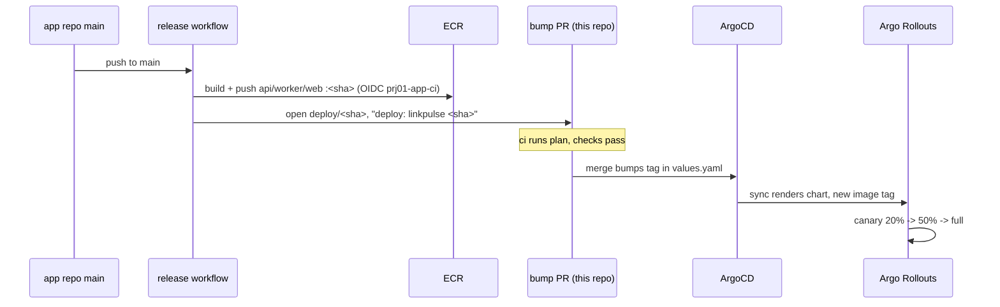

# GitOps flow

This is one commit followed from a merge in the app repo all the way to new pods
serving the new image, with the real workflow and pull request names. Nobody runs
`kubectl apply` at any point. The only human action after the code is written is
approving two pull requests.

## The loop, step by step

1. A change merges to `main` in `prj01-linkpulse-app`. That push triggers the
   `release` workflow.

2. The `release` workflow's `push` job (named "build and push images") assumes
   `arn:aws:iam::149536464688:role/prj01-app-ci` through GitHub OIDC, logs in to
   ECR, and builds and pushes all three service images (api, worker, web) tagged
   with the short git SHA. So for commit `d7ff9d1` the api image becomes
   `149536464688.dkr.ecr.il-central-1.amazonaws.com/prj01/linkpulse-api:d7ff9d1`.
   There are no AWS keys in the app repo; the OIDC role is push-only and scoped to
   the LinkPulse ECR repos.

   Before a change ever reaches `main`, the app repo's `ci` workflow has already
   run on the pull request: `ruff` lint and `pytest` with an 80 percent coverage
   gate on the api and worker, a `trivy` image scan that fails on HIGH or CRITICAL,
   and a `gitleaks` secret scan. A change that fails any of those does not merge, so
   the image the release workflow builds has already passed the gates.

3. The `release` workflow's `promote` job (named "open gitops bump pr") checks out
   this repo, rewrites the `tag:` line in `gitops/apps/dev/linkpulse/values.yaml` to
   the new short SHA, and opens a pull request here. The branch is `deploy/<sha>`,
   the title is `deploy: linkpulse <sha>`, and the body notes the images are already
   in ECR. This is the only place the app repo writes to the platform repo, and it
   writes exactly one line.

4. That pull request runs this repo's `ci` workflow: terraform fmt, validate,
   tflint, tfsec, checkov, a kubeconform pass over the gitops manifests, gitleaks,
   and a `terraform plan` posted back as a PR comment. A tag bump is a one-line
   change to a values file, so the plan is empty and the manifest checks pass, and
   the pull request is safe to merge.

5. Merging the pull request changes `main` in this repo. ArgoCD is watching, so on
   its next reconcile it sees the new tag in the values file.

6. The `linkpulse-dev` Application is a multi-source app. The chart comes from the
   app repo (`charts/linkpulse`), and the values come from this repo through the
   `$values` reference. ArgoCD renders the chart with the new values, sees that the
   desired image tag has moved, and syncs. Sync is automated with prune and
   self-heal, so no manual sync is needed.

7. The api is an Argo Rollout, so the sync does not just replace pods. It starts a
   canary.

## The canary progression

The Rollout strategy is replica-ratio based (ADR 007 explains why there is no
traffic router): setWeight 20, analysis, setWeight 50, analysis, then full
promotion. At the HPA floor of two api replicas, 20 percent is one canary pod
against two stable, and 50 percent is one against one. The bare weight progression
(without analysis) is captured in `docs/proof/rollout-canary-steps.txt`, and it
looks like this:

- The new ReplicaSet starts one canary pod while both stable pods keep serving.
- Once the canary pod is ready, the rollout holds at 20 percent for the step window.
- It moves to 50 percent, scaling stable down so the ratio holds, and holds again.
- On the last step it promotes fully, scales the canary up to the target count, and
  scales the old ReplicaSet to zero.

Between each weight step, Argo Rollouts runs two Prometheus AnalysisTemplates
against the canary pods only: success rate (target at or above 99 percent) and p95
latency (under 500ms), each sampled a few times with a small failure budget. The
step advances only if both pass. A healthy release passing its analysis and
completing on its own is captured in `docs/proof/canary-analysis-pass.txt`.

## What happens on a failed canary

The whole point of the canary is that a bad version never fully rolls out. A canary
whose success rate drops or whose latency climbs past the threshold fails its
AnalysisRun, and the rollout aborts. On abort, the canary ReplicaSet scales back
down and the stable ReplicaSet, which was never scaled to zero during the canary
steps, keeps serving every request. There is no gap: stable was carrying its share
of traffic the entire time, so aborting just returns all of it to stable.

This is proven, not theoretical. A fault-injection knob (`api.failRate` in the dev
values) was set above zero through a normal pull request, its canary pods returned
500s, the analysis failed, and Argo Rollouts rolled the release back on its own
while the stable pods served clean. The full capture is in
`docs/proof/canary-auto-rollback.txt`. The knob is kept at zero in normal operation.

Recovery is a git action, in keeping with the rest of the system. Revert the
`deploy/<sha>` pull request so the values file points back at the last good tag, and
ArgoCD reconciles the app back to it. For an immediate stop before the revert lands,
`kubectl argo rollouts abort linkpulse-api -n linkpulse-dev` halts the in-flight
rollout, and stable continues serving.

## Prod promotion

Promotion to prod is the same artifact, not a rebuild. Copy the proven short SHA
from the dev values file to the prod values file in a pull request, get it reviewed,
and merge. ArgoCD picks it up the same way. The image that ran through the dev
canary is the exact image that runs in prod.
