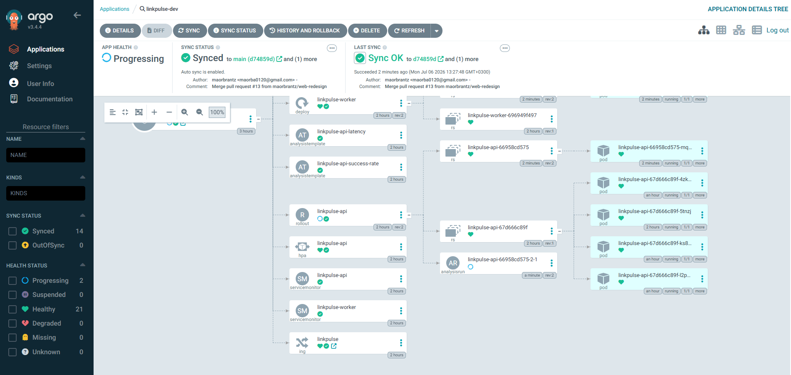
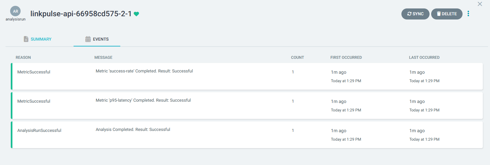
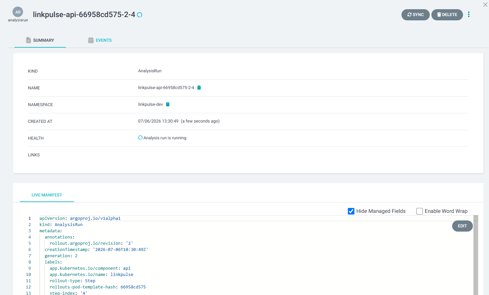
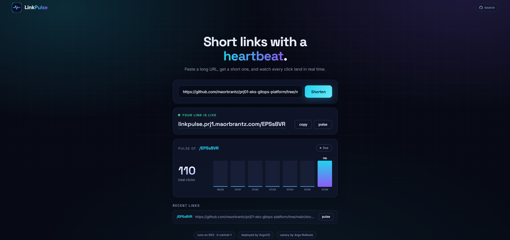
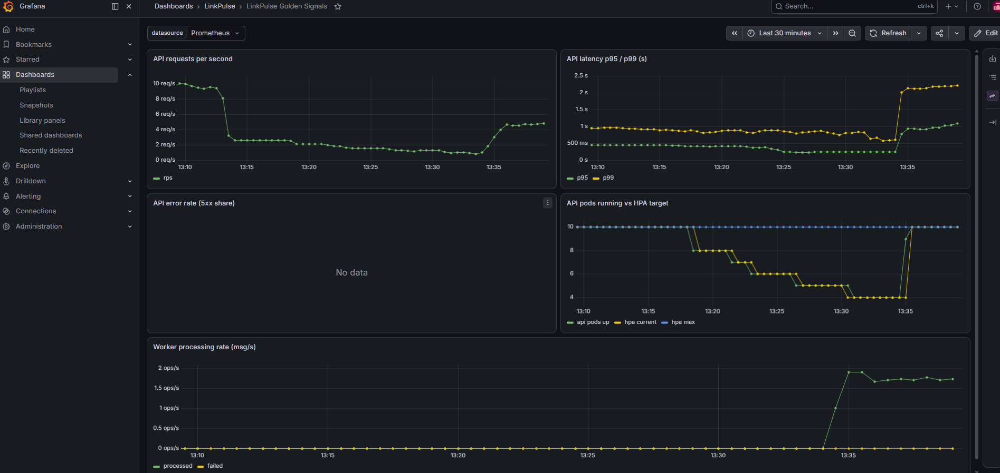

# Proof

Captured runs from real `make up` sessions, one file per behavior the platform claims. Each is raw command output with a short note on what it shows, kept as text so it reads in a diff and does not rot into a stale screenshot.

| Artifact | What it proves | Related PR |
|---|---|---|
| [rollout-canary-steps.txt](rollout-canary-steps.txt) | The GitOps loop delivers a new image tag and Argo Rollouts runs it as a canary, 20 to 50 to 100 percent, with the stable ReplicaSet never scaled to zero. | [#22](https://github.com/maorbrantz/prj01-eks-gitops-platform/pull/22), [#25](https://github.com/maorbrantz/prj01-eks-gitops-platform/pull/25) |
| [canary-analysis-pass.txt](canary-analysis-pass.txt) | Prometheus AnalysisTemplates run between the weight steps (success rate at or above 99 percent, p95 under 500ms). A healthy release passes and the rollout completes with no manual promotion. | [#26](https://github.com/maorbrantz/prj01-eks-gitops-platform/pull/26), [#34](https://github.com/maorbrantz/prj01-eks-gitops-platform/pull/34) |
| [canary-auto-rollback.txt](canary-auto-rollback.txt) | A release with an injected 500-error rate fails its analysis and Argo Rollouts aborts and rolls it back on its own. Stable pods serve every request throughout; users never see an error. | [#32](https://github.com/maorbrantz/prj01-eks-gitops-platform/pull/32), [#33](https://github.com/maorbrantz/prj01-eks-gitops-platform/pull/33), [#34](https://github.com/maorbrantz/prj01-eks-gitops-platform/pull/34) |
| [karpenter-scale-out.txt](karpenter-scale-out.txt) | Under a k6 load test the HPA scales the api from 2 to 10 replicas, Karpenter provisions a node for the pods that no longer fit, and consolidation removes it when load drops. Includes the `AWSServiceRoleForEC2Spot` finding and the spot node that replaced the on-demand one. | [#22](https://github.com/maorbrantz/prj01-eks-gitops-platform/pull/22), [#25](https://github.com/maorbrantz/prj01-eks-gitops-platform/pull/25) |
| [grafana-dashboards.txt](grafana-dashboards.txt) | The two dashboards-as-code show up in Grafana, all three datasources (Prometheus, Loki, Alertmanager) are wired, and querying the golden-signals panels returns live values. Loki has log streams for the app namespace. | [#26](https://github.com/maorbrantz/prj01-eks-gitops-platform/pull/26), [#34](https://github.com/maorbrantz/prj01-eks-gitops-platform/pull/34) |

The GitOps deploy loop, ArgoCD self-heal, and Kyverno blocking a bad pod are visible directly in the pull request history rather than as a transcript here: [#4](https://github.com/maorbrantz/prj01-eks-gitops-platform/pull/4) and [#15](https://github.com/maorbrantz/prj01-eks-gitops-platform/pull/15) stand up ArgoCD and the app through GitOps.

## Screenshots

Captured live during a rebuild session, while the web ui redesign shipped through the pipeline.

### A canary mid-rollout in ArgoCD

The app is Progressing while the new ReplicaSet runs next to stable and an AnalysisRun judges it against Prometheus. The sync comment is the merge of the deploy PR. No kubectl anywhere.

### The analysis verdict

Both metrics evaluated against live Prometheus data, then the rollout continued on its own.

### The app, live

https://linkpulse.prj1.maorbrantz.com with the pulse view on live refresh. Every click flows through SQS and the worker into DynamoDB before it lands on this chart.

### Golden signals under load

The load generator stopping and restarting is visible in the request rate, the HPA follows it from 10 pods down to 4 and back, and the worker processing rate wakes up the moment clicks start flowing.

